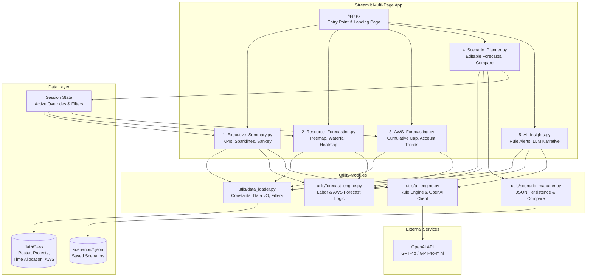

# Architecture — Enhanced FP&A Planning Dashboard

## Overview

The Enhanced FP&A Planning Dashboard is a multi-page Streamlit application designed for automated financial planning and analysis. It provides resource cost forecasting, AWS hosting cost forecasting, interactive scenario planning, and AI-powered narrative generation.

## System Architecture



## File Structure

```
group_project/
├── app.py                              # Entry point, page config, landing page
├── requirements.txt                    # Pinned dependencies
├── data/
│   ├── roster.csv                      # Employee hierarchy, rates, locations
│   ├── project-list.csv                # Project metadata, accounting classification
│   ├── time-allocation.csv             # Employee × project × month hours
│   └── aws-model.csv                   # AWS account costs by month
├── pages/
│   ├── 1_Executive_Summary.py          # KPI cards, sparklines, Sankey diagram
│   ├── 2_Resource_Forecasting.py       # Treemap, waterfall, heatmap, filters
│   ├── 3_AWS_Forecasting.py            # Cumulative cap chart, account trends
│   ├── 4_Scenario_Planner.py           # Editable grids, project adjustments, compare
│   └── 5_AI_Insights.py               # Rule-based alerts, OpenAI narrative
├── utils/
│   ├── __init__.py                     # Package marker
│   ├── data_loader.py                  # Data loading, constants, shared filters
│   ├── forecast_engine.py              # Labor and AWS forecasting logic
│   ├── ai_engine.py                    # Rule-based insights + OpenAI integration
│   └── scenario_manager.py            # Scenario CRUD + comparison logic
├── scenarios/                          # Saved scenario JSON files
│   └── .gitkeep
└── docs/
    ├── implementation-plan.md
    ├── architecture.md
    └── requirements-spec.md
```

## Module Responsibilities

### `app.py` — Entry Point

- Sets `st.set_page_config(layout="wide")` for the entire app
- Displays landing page with project overview and navigation guidance
- Does NOT contain business logic — purely routing and branding

### `utils/data_loader.py` — Shared Data Layer

| Responsibility | Details |
|---|---|
| Constants | `MONTHS`, `ACTUAL_MONTHS`, `FORECAST_MONTHS`, color palette, PTO caps, project IDs |
| `load_data()` | Cached CSV loading with type coercion and currency cleaning |
| `clean_currency()` | Strips `$` and `,` from monetary string columns |
| `apply_filters()` | Shared filter logic (leader, type, location, FBU, project) |
| Session state helpers | Read/write active filters and scenario overrides from `st.session_state` |

### `utils/forecast_engine.py` — Forecasting Logic

| Responsibility | Details |
|---|---|
| `forecast_labor()` | Full labor forecast: PTO allocation, project sunset, hour normalization to 160, cost calculation |
| `forecast_aws()` | AWS forecast: 5% growth accounts, weighted average for others |
| `apply_overrides()` | Merge scenario overrides into baseline forecast, recompute costs |
| `labor_monthly_summary()` | Aggregate labor by month with actual/forecast typing |
| `aws_monthly_summary()` | Aggregate AWS by month with actual/forecast typing |
| `labor_by_dimension()` | Group labor costs by any dimension (FBU, project, type, etc.) |
| `build_validation_table()` | Per-employee validation of hours and PTO constraints |

### `utils/ai_engine.py` — AI & Insights

| Responsibility | Details |
|---|---|
| `generate_rule_based_insights()` | Runs all rules against current data, returns prioritized alert list |
| `generate_llm_narrative()` | Builds structured prompt from data context, calls OpenAI, returns markdown narrative |
| Rule: PTO proximity | Flags employees at >80% of annual PTO cap |
| Rule: MoM cost swing | Flags projects with >20% month-over-month cost change |
| Rule: AWS growth | Flags growth accounts and cap proximity |
| Rule: top cost drivers | Identifies top 3 projects by total cost |
| Rule: sunset impact | Summarizes reallocation from ended projects |

### `utils/scenario_manager.py` — Scenario Persistence

| Responsibility | Details |
|---|---|
| `save_scenario()` | Serialize overrides + metadata to `scenarios/{name}.json` |
| `load_scenario()` | Deserialize JSON and apply to session state |
| `list_scenarios()` | Scan `scenarios/` directory for available files |
| `delete_scenario()` | Remove a scenario JSON file |
| `compare_scenarios()` | Load two scenarios, compute delta KPIs, return comparison DataFrame |

## Data Flow

### Read Path (Page Load)

```
CSV Files → data_loader.load_data() → forecast_engine.forecast_*()
    → Session State (check for active overrides)
        → forecast_engine.apply_overrides()
            → Page renders with final computed data
```

### Write Path (Scenario Editing)

```
User edits in st.data_editor → Session State (overrides dict)
    → forecast_engine.apply_overrides() → Real-time cost recalculation
        → Page re-renders with updated values
```

### Persist Path (Save Scenario)

```
Session State overrides → scenario_manager.save_scenario()
    → scenarios/{name}.json written to disk
```

### AI Path (Generate Narrative)

```
forecast_engine outputs + ai_engine.generate_rule_based_insights()
    → Structured prompt construction
        → OpenAI API call → Markdown narrative displayed
```

## Session State Schema

```python
st.session_state = {
    # Active filters (shared across pages)
    "filter_leader": "All",
    "filter_type": "All",
    "filter_location": "All",
    "filter_fbu": "All",
    "filter_project": "All",
    "filter_dimension": "Funding Business Unit",

    # Scenario overrides
    "active_scenario_name": None,
    "overrides": {
        # Key: (employee_id, project_number, month) → hours value
        ("EMP0001", "P00002", "Apr"): 80.0,
    },

    # Project-level targets
    "project_targets": {
        # Key: project_number → {"type": "budget"|"hours", "value": float}
        "P00003": {"type": "budget", "value": 50000.0},
    },
}
```

## Color Palette

| Token | Hex | Usage |
|---|---|---|
| `COLOR_ACTUAL` | `#1f77b4` | Actual period data |
| `COLOR_FORECAST` | `#ff7f0e` | Forecast period data |
| `COLOR_LABOR` | `#2a6fdb` | Labor-specific charts |
| `COLOR_AWS` | `#00a878` | AWS-specific charts |
| `COLOR_ALERT` | `#d62728` | Warnings and cap breaches |
| `COLOR_NEUTRAL` | `#6c757d` | Secondary/reference lines |

## Key Design Decisions

1. **Multi-page over single-file**: Separation of concerns, easier maintenance, clearer navigation for end users (leaders viewing different aspects of the forecast).

2. **Session state for overrides**: Enables real-time editing without page refresh. Overrides are deltas from baseline, not full data copies — keeps state lightweight.

3. **JSON file persistence for scenarios**: Simple, human-readable, no database dependency. Scenarios are portable and can be version-controlled.

4. **Rule-based + LLM dual approach for AI**: Rule-based alerts work offline and are deterministic. LLM narrative adds natural-language storytelling when API key is available.

5. **Shared utility modules**: All pages import from `utils/` — single source of truth for data loading, forecasting logic, and business rules. No duplicated code across pages.
