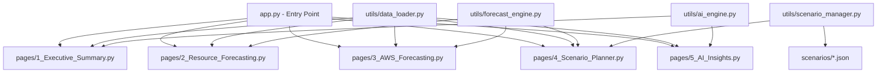

# Implementation Plan — Enhanced FP&A Planning Dashboard

## Problem Statement

The existing single-file Streamlit dashboard covers core forecasting logic but lacks advanced visualizations, AI-driven narrative, and interactive scenario/what-if capabilities. We need to transform it into a multi-page app with rich chart types, editable forecasts at multiple levels, named scenario management with local file persistence, and OpenAI-powered commentary.

## Requirements

1. Multi-page Streamlit app structure
2. Improved visualizations: treemaps, waterfalls, heatmaps, sparklines, KPI trend cards, Sankey diagrams
3. AI commentary: rule-based alerts + OpenAI LLM narrative generation
4. Editable forecasts: employee-level, project-level, and named scenario comparisons
5. Scenario persistence: save/load scenarios as JSON files locally
6. AWS cap enforcement display (uncapped forecast + alert)

## Background

- Current app is a single 600-line `app.py` using Streamlit, Pandas, NumPy, and Plotly
- Data: 4 CSV files (roster, project-list, time-allocation, aws-model) in `data/` directory
- Forecasting logic is already complete and validated
- OpenAI API key to be provided later (wire up integration with placeholder config)

## Proposed Solution



### File Structure

```
app.py                          — Entry point / landing page
pages/
  1_Executive_Summary.py        — KPI cards, sparklines, Sankey diagram, AI summary
  2_Resource_Forecasting.py     — Labor forecasting, treemaps, waterfalls, heatmaps
  3_AWS_Forecasting.py          — AWS forecasting, cumulative cap chart, account trends
  4_Scenario_Planner.py         — What-if controls, editable forecasts, scenario compare
  5_AI_Insights.py              — Rule-based alerts, OpenAI narrative generation
utils/
  data_loader.py                — Shared data loading, constants, filters
  forecast_engine.py            — Labor and AWS forecasting functions
  ai_engine.py                  — Rule-based insights + OpenAI integration
  scenario_manager.py           — Scenario save/load/compare logic
scenarios/                      — JSON persistence directory for saved scenarios
requirements.txt                — Pinned dependencies
```

---

## Task Breakdown

### Task 1: Project Restructure and Shared Data Layer

**Objective:** Convert the single-file app into a multi-page Streamlit structure with shared utilities.

**Implementation:**
- Create `pages/` and `utils/` directories
- Extract `load_data()`, `clean_currency()`, constants, and filter logic into `utils/data_loader.py`
- Extract forecasting functions into `utils/forecast_engine.py`
- Create minimal `app.py` as home/landing page
- Add `requirements.txt` with pinned dependencies (streamlit, pandas, numpy, plotly, openai)

**Test:**
- Run `streamlit run app.py` and verify multi-page navigation appears in the sidebar
- Confirm data loads correctly from the shared module

**Demo:** Multi-page Streamlit app launches with sidebar navigation showing all page names; landing page displays project title and brief description.

---

### Task 2: Executive Summary Page with KPI Cards and Sparklines

**Objective:** Build the Executive Summary page with trend-aware KPI metrics and sparkline mini-charts.

**Implementation:**
- Create `pages/1_Executive_Summary.py`
- Display full-year labor forecast, AWS forecast, total budget, and AWS variance-to-cap as metric cards with delta indicators (comparing forecast vs actuals trend)
- Add inline sparklines using Plotly subplot figures for monthly cost trends
- Include a summary table of top 5 cost drivers

**Test:**
- Verify KPI values match the existing dashboard's computed totals
- Verify sparklines render for each metric

**Demo:** Executive Summary page shows 4-6 KPI cards with up/down trend arrows and embedded sparkline charts showing monthly progression.

---

### Task 3: Sankey Diagram for Budget Flow Visualization

**Objective:** Add a Sankey diagram showing money flow from Funding Business Unit → Project → Employee Type.

**Implementation:**
- On the Executive Summary page, add a Plotly Sankey chart
- Nodes: Funding BUs, Projects (top 10 by cost), Employee Types (FTE/Contractor)
- Links: weighted by full-year labor cost flowing through each path
- Color coded per funding BU

**Test:**
- Verify Sankey link values sum correctly to total labor cost
- Verify all funding BUs and employee types appear

**Demo:** Interactive Sankey diagram where hovering shows dollar amounts flowing between funding sources, projects, and resource types.

---

### Task 4: Resource Forecasting Page with Treemap and Waterfall Charts

**Objective:** Rebuild the Resource Forecasting page with enhanced visualizations.

**Implementation:**
- Create `pages/2_Resource_Forecasting.py`
- Include:
  1. Treemap showing budget composition by Funding BU / Project / Employee
  2. Waterfall chart showing cost build-up by category (base labor, PTO, meetings, project sunset impact)
  3. Monthly bar chart with actual vs forecast color differentiation
- Include existing sidebar filters

**Test:**
- Verify treemap segments sum to total labor cost
- Verify waterfall start + increments = total

**Demo:** Resource page shows an interactive treemap (click to drill into BU → Project → Employee) and a waterfall chart explaining how total cost builds up from components.

---

### Task 5: Employee/Project Utilization Heatmap

**Objective:** Add a heatmap showing hours allocation across employees and months (or projects and months).

**Implementation:**
- On the Resource Forecasting page, add a Plotly heatmap with employees on the y-axis, months on the x-axis, and color intensity = hours allocated
- Add a toggle to switch between "by employee" and "by project" views
- Highlight cells where hours = 0 (post-sunset) in a distinct color

**Test:**
- Verify heatmap values match the time allocation data
- Verify project sunset months show zero correctly

**Demo:** Color-coded heatmap clearly showing utilization patterns; users can toggle between employee and project views and spot the project 10/14 sunset visually.

---

### Task 6: AWS Forecasting Page with Enhanced Charts and Cap Visualization

**Objective:** Rebuild the AWS page with better trend visualization and cap enforcement display.

**Implementation:**
- Create `pages/3_AWS_Forecasting.py`
- Include:
  1. Cumulative area chart showing AWS spend building toward the $2.1M cap line
  2. Individual account trend lines with growth accounts highlighted
  3. Stacked bar showing account-level contribution per month
- Display a prominent alert banner if forecast exceeds cap

**Test:**
- Verify cumulative total in December matches the full-year forecast sum
- Verify growth accounts show 5% MoM increase pattern

**Demo:** AWS page shows cumulative spend curve approaching the cap line, with individual account breakdowns and a clear alert if over budget.

---

### Task 7: Editable Forecast — Employee-Level Overrides

**Objective:** Allow managers to override individual employee hour allocations per project per month.

**Implementation:**
- Create `pages/4_Scenario_Planner.py`
- Use `st.data_editor` to display a filtered view of employee × project × month allocations
- When a user edits a cell, recalculate that employee's total hours and flag if ≠ 160
- Store overrides in `st.session_state`
- Add a "Reset to Baseline" button
- Recompute costs in real-time using the hourly rate

**Test:**
- Verify editing a cell updates the cost calculation
- Verify 160-hour constraint is flagged visually when violated

**Demo:** Manager selects an employee, sees their project allocations in an editable grid, changes hours on a project, and sees cost totals update immediately with a validation indicator.

---

### Task 8: Editable Forecast — Project-Level Adjustments

**Objective:** Allow project-level budget adjustments that auto-distribute across employees.

**Implementation:**
- On the Scenario Planner page, add a "Project-Level Adjustments" section
- Show a table of projects with total forecasted hours and cost
- Allow the user to set a target budget or hours for a project
- Auto-distribute the change proportionally across employees assigned to that project (weighted by their current allocation)
- Reflect changes in the employee-level grid

**Test:**
- Verify that adjusting project total redistributes correctly (proportional to baseline)
- Verify employee 160-hour validation still works after redistribution

**Demo:** Manager sets Project X budget to $50,000, system auto-distributes hours across 4 employees proportionally, and the employee grid reflects the new allocations.

---

### Task 9: Scenario Save/Load/Compare with Local JSON Persistence

**Objective:** Enable named scenarios that persist as JSON files and can be compared side-by-side.

**Implementation:**
- Create `utils/scenario_manager.py`
- Scenarios store: name, timestamp, description, all overrides (employee-level and project-level deltas from baseline)
- Save to `scenarios/` directory as JSON
- Add UI for "Save Scenario", "Load Scenario" (dropdown of saved files), "Delete Scenario", and "Compare Scenarios" (side-by-side KPI table + overlay chart showing two scenarios' monthly costs)

**Test:**
- Verify save creates a valid JSON file
- Verify load restores overrides correctly
- Verify compare shows accurate deltas between scenarios

**Demo:** Manager saves "Aggressive Growth" scenario, creates a "Conservative" scenario with different assumptions, then compares them side-by-side with a delta table and overlay line chart.

---

### Task 10: Rule-Based AI Insights Engine

**Objective:** Build a rule-based engine that generates actionable alerts and insights without external API.

**Implementation:**
- Create `utils/ai_engine.py`
- Implement rules:
  1. Flag employees near PTO cap (>80% used)
  2. Flag projects with >20% MoM cost swing
  3. Flag AWS accounts approaching growth threshold
  4. Identify top 3 cost drivers
  5. Summarize project sunset reallocation impact
  6. Flag if total forecast exceeds prior year + X%
- Return insights as a list of dicts with severity (info/warning/critical), category, and message

**Test:**
- Verify each rule fires correctly given known data conditions (e.g., growth accounts should trigger the AWS growth alert)
- Verify insights are categorized and sorted by severity

**Demo:** AI Insights page shows a prioritized list of alerts — e.g., "⚠️ AWS accounts 8, 11, 27 growing 5% MoM — forecast $X above cap" and "ℹ️ Projects 10 and 14 sunset in August — $Y in costs will be reallocated."

---

### Task 11: OpenAI LLM Narrative Integration

**Objective:** Wire up OpenAI API to generate natural-language summaries of the forecast data.

**Implementation:**
- Create `pages/5_AI_Insights.py`
- Add a "Generate AI Summary" button that sends a structured prompt to OpenAI with: total budget, labor/AWS split, top projects, key trends, alerts from the rule engine
- Display the LLM response in a styled markdown container
- Use `st.secrets` or environment variable for the API key
- Include error handling for missing key / API failures
- Add context to the prompt so the LLM "tells the story" of the organization as the requirements suggest

**Test:**
- Verify graceful handling when API key is missing (show informative message, not crash)
- Verify prompt includes relevant data context
- Test with a mock response if key unavailable

**Demo:** User clicks "Generate AI Summary", sees a 2-3 paragraph narrative like "This business unit is forecasting $X in total spend for 2026. Labor costs represent Y% of the budget, driven primarily by [top projects]. Key risks include..."

---

### Task 12: Integration, Polish, and Cross-Page Consistency

**Objective:** Wire all pages together, ensure consistent styling, and verify end-to-end functionality.

**Implementation:**
- Ensure filters in the sidebar are shared across pages via session state
- Add consistent color scheme and branding across all pages
- Add a page-level loading state for heavy computations
- Ensure scenario overrides propagate to all views (Executive Summary, Resource page, AWS page should all reflect active scenario)
- Add a footer with assumptions on each page
- Update `requirements.txt` with final dependencies

**Test:**
- Verify applying a scenario on the Planner page updates KPIs on Executive Summary
- Verify filters work consistently across pages
- Verify no import errors or broken references between modules

**Demo:** Full end-to-end workflow: user views Executive Summary, drills into Resource Forecasting, creates a what-if scenario, saves it, generates AI commentary, and sees consistent numbers throughout.

---

## Dependencies

| Package | Version | Purpose |
|---------|---------|---------|
| streamlit | >=1.35.0 | Multi-page app framework |
| pandas | >=2.2.0 | Data manipulation |
| numpy | >=1.26.0 | Numerical operations |
| plotly | >=5.22.0 | Advanced visualizations |
| openai | >=1.30.0 | LLM narrative generation |

## Timeline Estimate

| Phase | Tasks | Effort |
|-------|-------|--------|
| Foundation | Tasks 1 | 1 day |
| Visualizations | Tasks 2–6 | 3–4 days |
| Interactivity | Tasks 7–9 | 3–4 days |
| AI Integration | Tasks 10–11 | 2 days |
| Polish | Task 12 | 1 day |
| **Total** | | **~10–12 days** |
